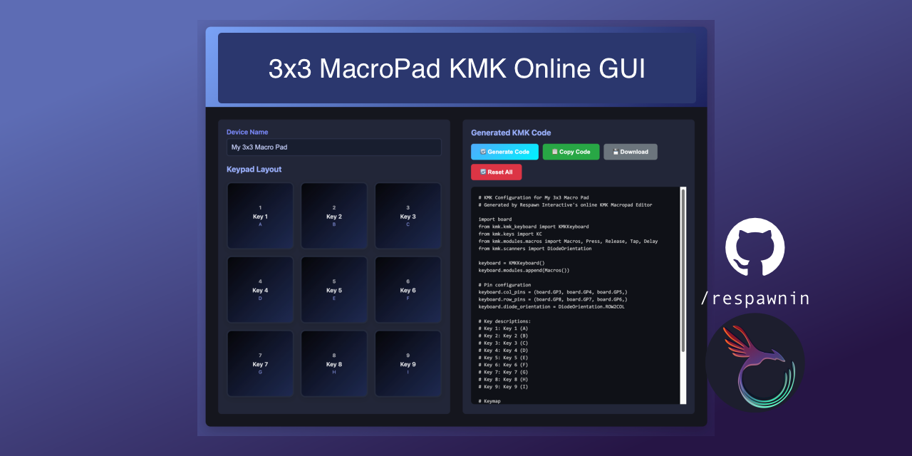

# 3x3 Macro Pad GUI Configurator

An **online GUI tool** to easily generate [KMK Firmware](https://github.com/KMKfw/kmk_firmware) code for your **3x3 macro keypad** (RP2040-based).  
This site provides a simple graphical web interface for you to configure your keypad without manually editing Python code.

---
## 📸 Preview



---
## 🔗 Live Demo

👉 [Try it here](https://respawnin.github.io/3x3MacroPadGUI/)

---

## 🖥️ How It Works

1. Open the [online configurator](https://respawnin.github.io/3x3MacroPadGUI/).
2. Click on any of the **9 keys** in the 3x3 grid.
3. Select the action you want:
   - Simple keys (`KC.A`, `KC.B`, etc.)
   - Macros (`Ctrl+C`, `Ctrl+V`, etc.)
   - Custom text output
4. Your KMK Python configuration is **automatically generated** when you click "Generate Code".
5. Copy the generated code and save it as 'code.py' on your RP2040 running KMK.

---


## ⚡ Features

- No install required — runs directly in your browser  
- Generates **ready-to-flash KMK code**  
- Supports modifiers, macros, and text typing  

---

##  ℹ️ Notes

- This was written to support a board I made with the following pinout.
```python
# Pin configuration
keyboard.col_pins = (board.GP3, board.GP4, board.GP5,)
keyboard.row_pins = (board.GP8, board.GP7, board.GP6,)
keyboard.diode_orientation = DiodeOrientation.ROW2COL
```
- Feel free to modify based on your own board's pinout.

---

## 📜 License

MIT License – feel free to use, modify, and share with attribution.
